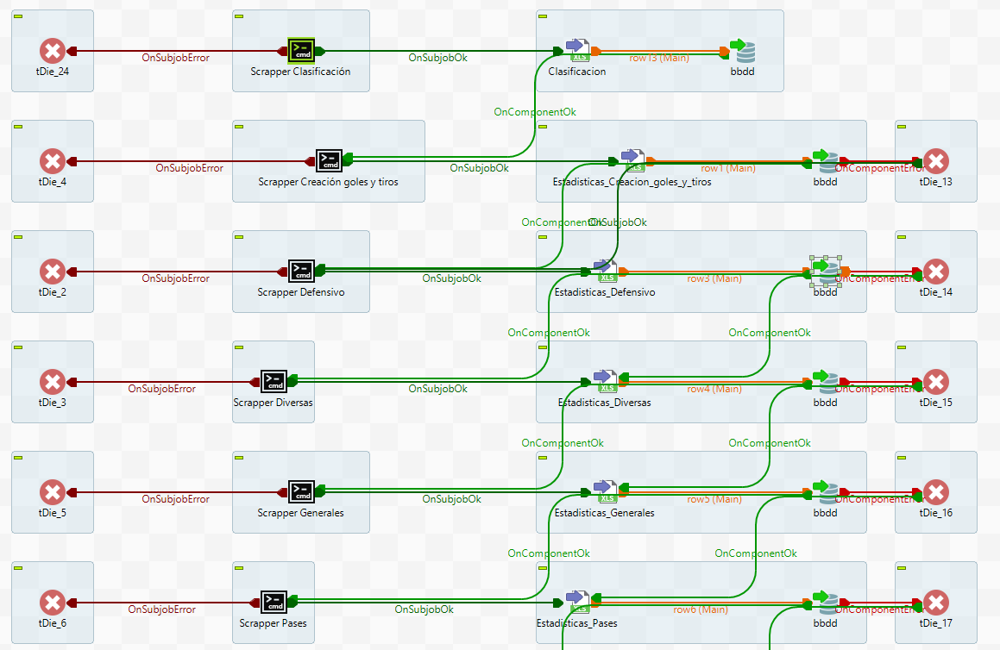

# laliga_2023-2024
| **Recources** |  |  | |   |
|---------------|:---:|:---:|---|---|
| **Adapted**   ||  |   |   |

>### Status

Project developed with a scrapper made in python, with the extraction of data from a website, transformation and treatment of the data in an Excel and dumping of the same in MySQL. Data exploitation carried out in Power BI, with detail in design and visualization of the data.

### Process developed with Talend

### Presentation of data in Power BI

> Fictitious data have been used in the project

